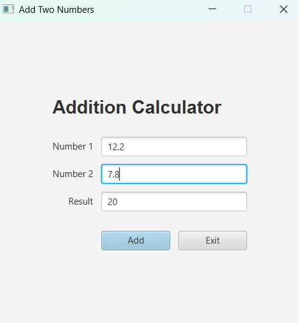

# JavaFX Addition Calculator

A lightweight desktop application built with JavaFX, focusing on clean code structure and smooth keyboard UX.

## Key Features

* **Keyboard Navigation:** Pressing `Enter` moves focus between fields, and the add action is bound to `setDefaultButton` for mouse-free calculation.
* **Clean Output Formatting:** Dynamically strips unnecessary decimals for integer results (e.g., `20` instead of `20.0`).
* **Code Structure:** Decouples UI setup, event listeners, and calculation logic into dedicated helper methods.
* **Input Validation:** Catches non-numeric inputs gracefully using alert dialogs.

## Tech Stack
* Java
* JavaFX
